# Capstone Proposal

### Author: Maggie Mengjiao Zhang

## Overview

### Statement

**TailFinder** is an exciting new platform that helps reunite lost pets with their families. Let's bring those furry friends back where they belong!

### Problem

Losing a pet is a distressing experience. Pets cannot communicate their location, and microchips do not provide real-time tracking. Access to microchip data is restricted to shelters and authorized personnel, leaving pet owners anxious and powerless.

With **TailFinder**, we make finding lost pets easier through social posting and map pinning features. Imagine the relief and joy of reuniting with a lost pet. **TailFinder** is here to help make that happen, turning tearful moments into happy reunions!

### User Profile

- Pet lovers who:

  - have recently lost their pets

  - are happy to help searching for pets through community posting

  - want to keep track of their pets early

### Features

- As a user, I want to be able to browse and find general info on latest lost pets in my city / around my location
- As a user, I want to be able to post possible lost pet info by assistance of a live map pinning
- As a user, I want to be able to share info about my pets and stories about finding my pets
- As a user, I want to be able to login to my account to manage my tracked pets
- As a logged in user, I want to be able to access user submitted info through validation process
- As a logged in user, I want to be able to see my tracked pets info

## Implementation

### Tech Stack

- React

- JavaScript

- MySQL

- Express

- Node

- Client libraries:

  - react

  - react-router

  - axios

- Server libraries:

  - knex

  - express

  - bcrypt

### APIs

- Mapbox API will be used for the first sprint to generate live map

- RESTful API will be created throughout the sprints

### Sitemap

- Home page

- Pet map

- View + Share Pet Info

- Community Board

- Register

- Login

- Browse Tracked Pets

- Browse Community Posts

- Access Pet Info through Form Validation

### Mockups

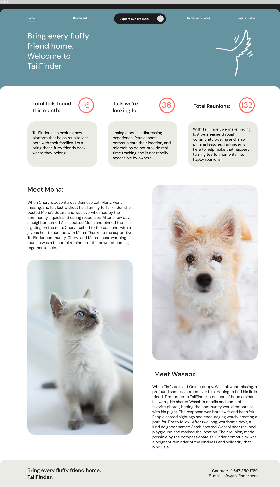

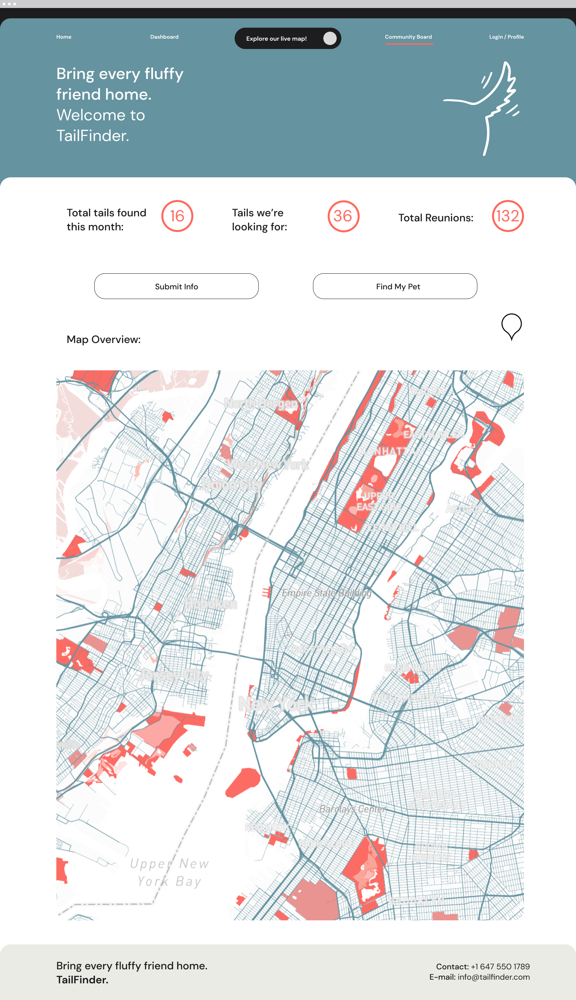

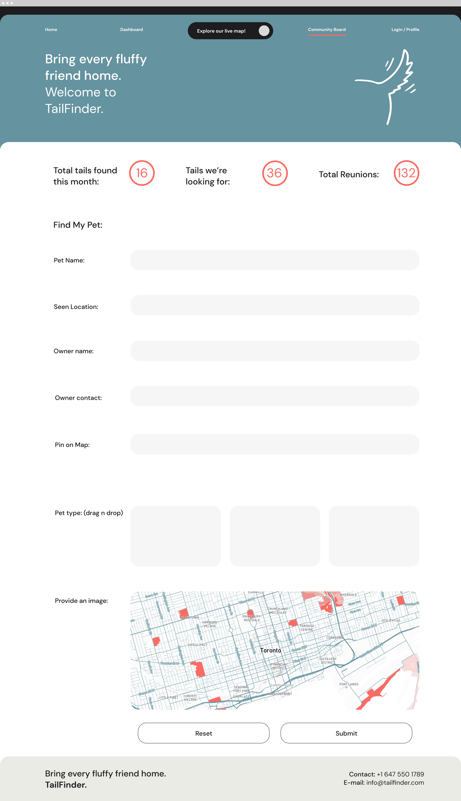

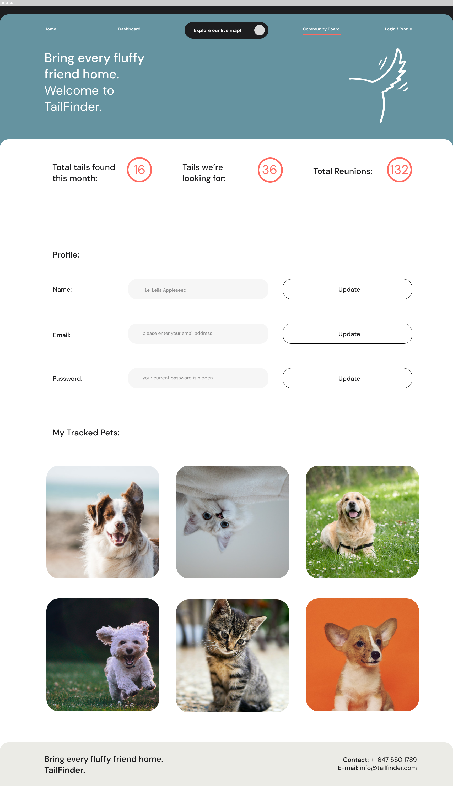

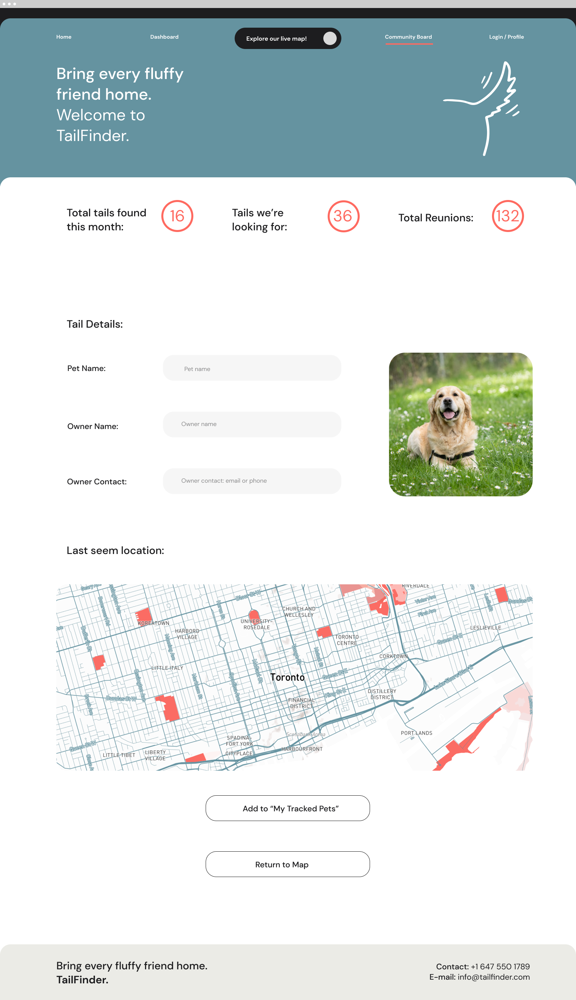

<!-- 

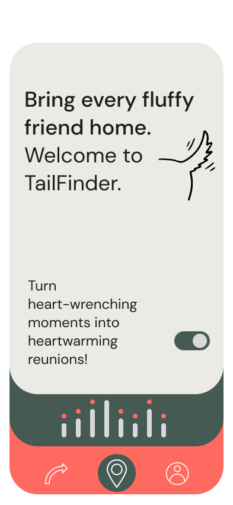
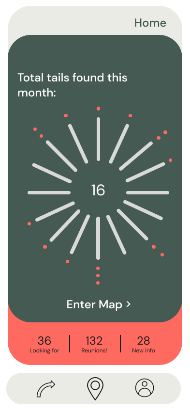
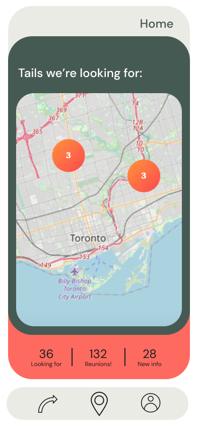
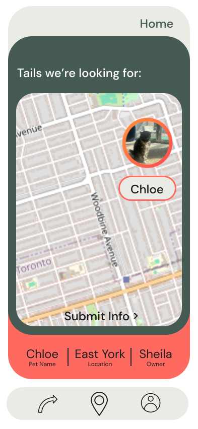
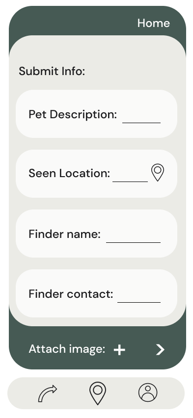
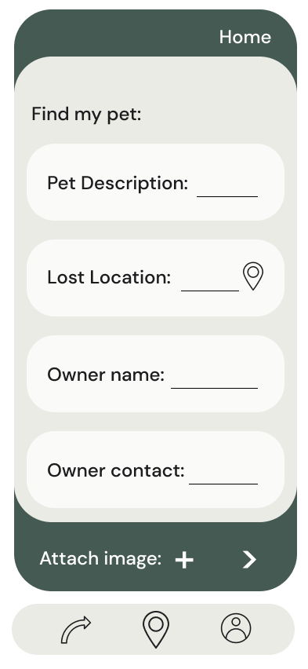
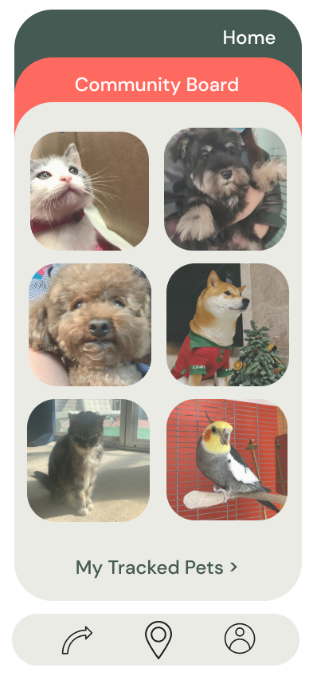
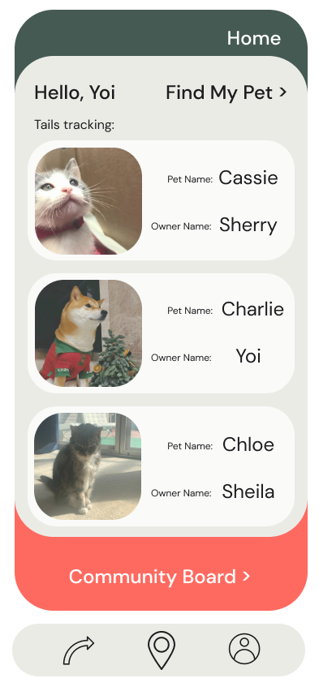
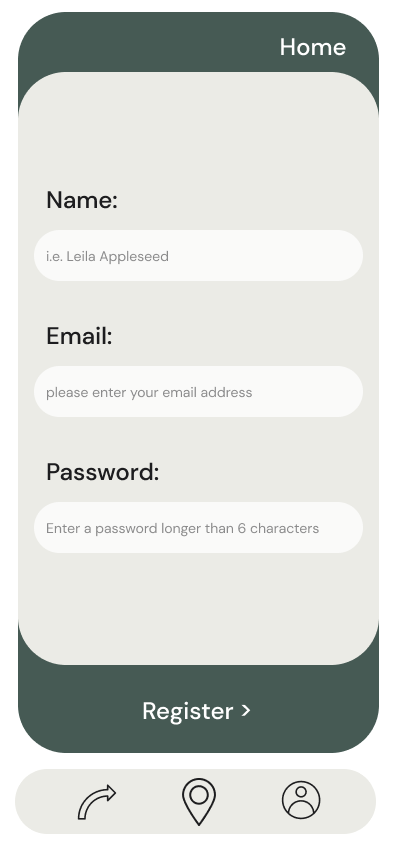
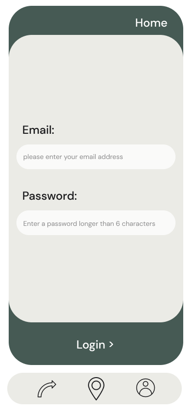

 -->
